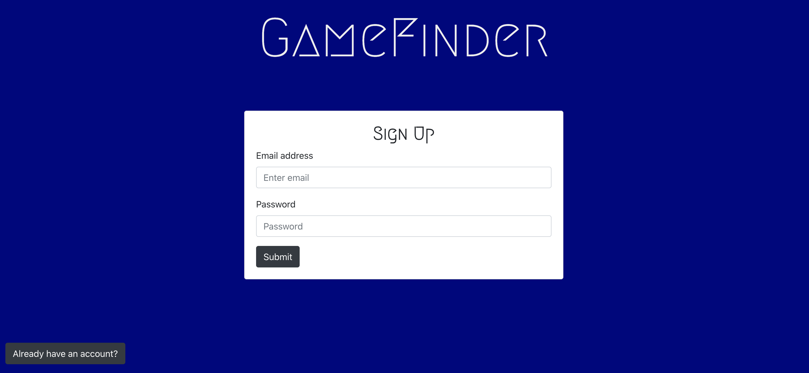
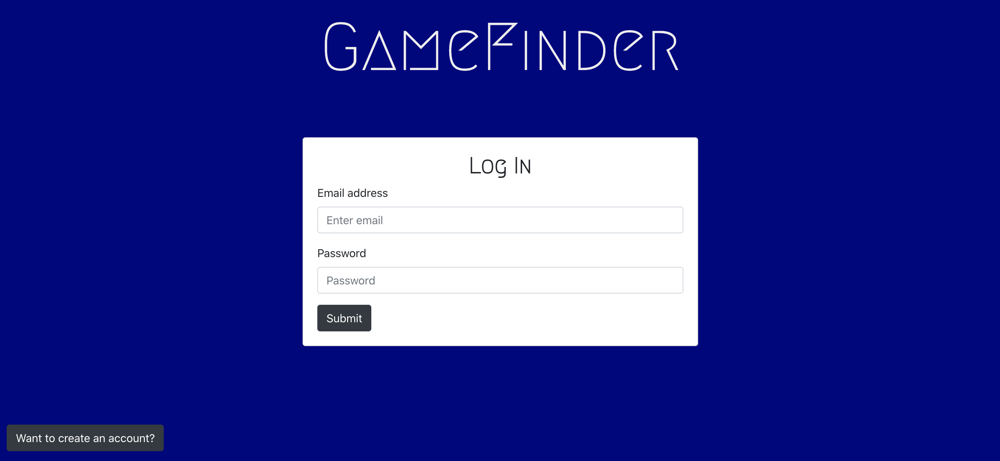
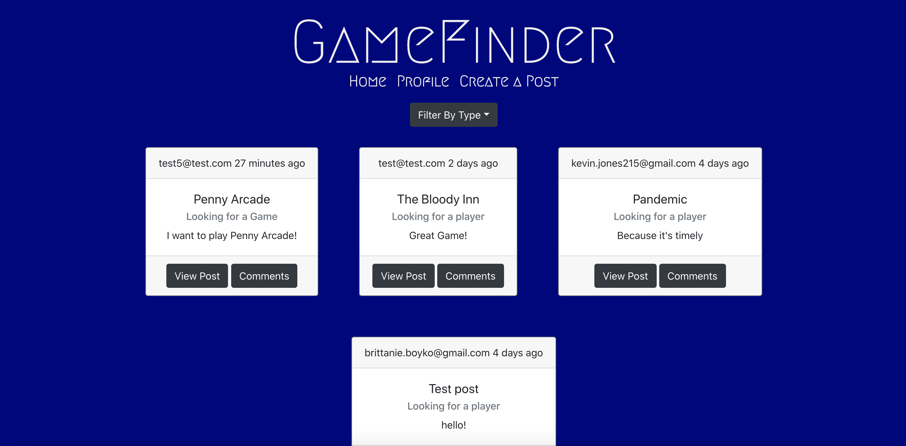
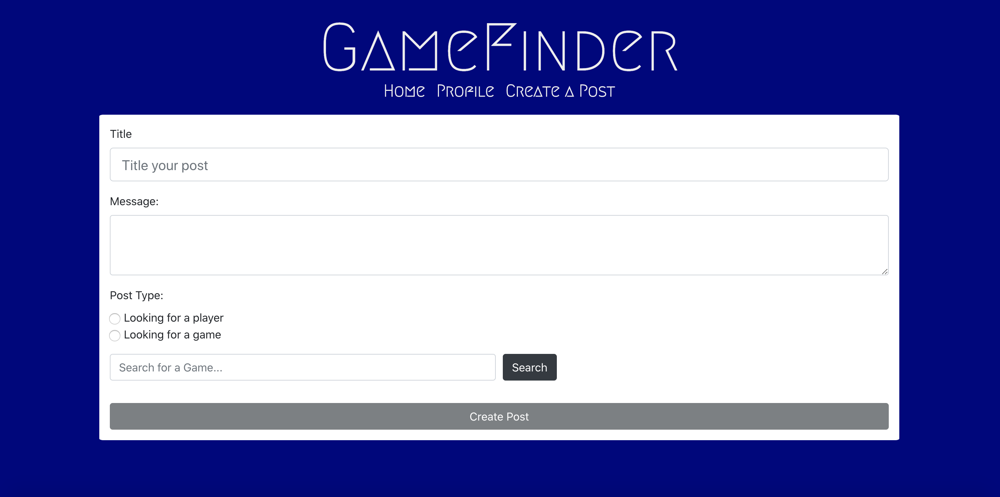

## GameFinder

# User Story

AS A board game love

I WANT to meet other board game players

SO THAT I can meet new people, discover new games, and make friends!

# Description

GameFinder is a website devoted to helping people find groups to play board games and table top games with! Users can create an account and make posts either looking for players to join their game, or games to join themself! Users can comment on other users posts, and see all comments that have been left. They may also delete their own posts, in case they change their mind.

# Built Using

React
React-Bootstrap (https://react-bootstrap.github.io/)
JSON Web Tokens

# Screenshot

Sign Up Page:

Log In Page:

Home Page:

Profile Page:

Create A Post Page:

# Links

Deployed App:  https://game-finder-2020.herokuapp.com/

Github Repo:  https://github.com/mms211/Game-Finder

# Authors

Kevin Devine-Jones
Github: https://github.com/kaydeejay

Brittanie Boyko
Github: https://github.com/brittanieboyko
Portfolio: https://brittanieboyko.herokuapp.com/

Morgan Sommer
Github: https://github.com/mms211
Portfolio: https://morgan-sommer-portfolio.herokuapp.com/

